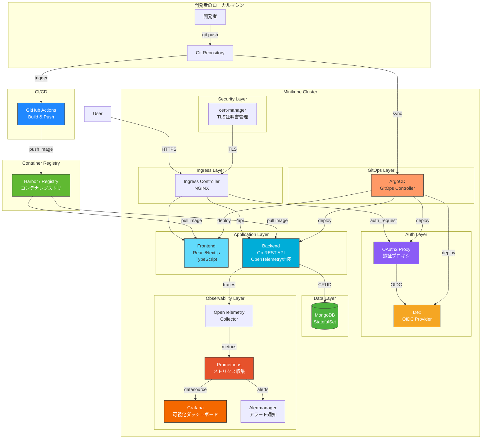
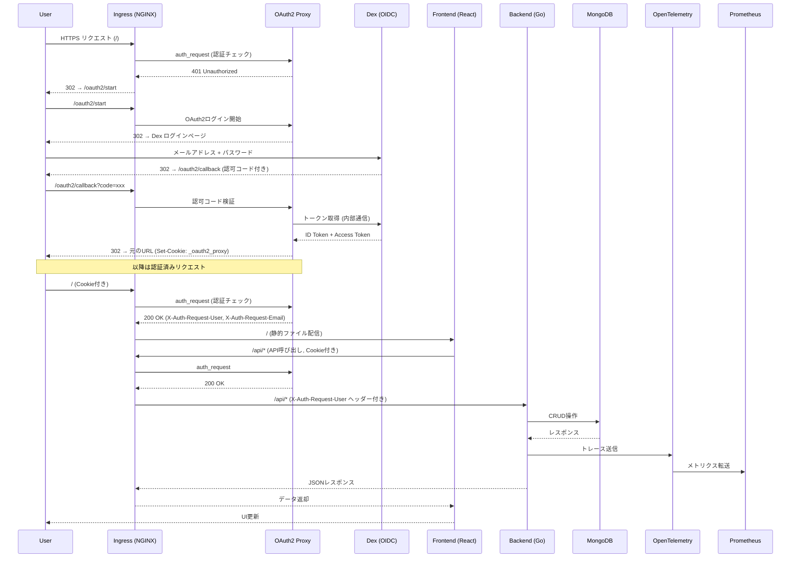

# 🎓 CKAD学習用フルスタックKubernetesプロジェクト

> **Certified Kubernetes Application Developer (CKAD)** の出題範囲を実践的に学ぶための、GitOps対応フルスタック教材プロジェクトです。

---

## 📖 目次

1. [アーキテクチャ](#アーキテクチャ)
2. [技術スタック](#技術スタック)
3. [CKAD資格概要](#ckad資格概要)
4. [この教材での学習内容](#この教材での学習内容)
5. [ディレクトリ構成](#ディレクトリ構成)
6. [環境構築手順](#環境構築手順)
7. [推奨書籍・学習リソース](#推奨書籍学習リソース)
8. [トラブルシューティング](#トラブルシューティング)

---

## アーキテクチャ

### システム全体構成図



### リクエストフロー（認証付き）



### 技術スタック選定理由

| 技術 | 役割 | 選定理由 |
|------|------|----------|
| **Helmfile** | マニフェスト管理 | 複数のHelmリリースを宣言的に一元管理でき、環境差分(dev/staging/prod)を`values`で切り替え可能。`helmfile sync`一発で全コンポーネントを構築できる。 |
| **ArgoCD** | GitOpsデプロイ | Gitリポジトリをsingle source of truthとし、宣言的にクラスタ状態を同期。CKADでも実務でも必須のGitOps知識が身につく。 |
| **Prometheus + Grafana** | 監視・可視化 | Kubernetesエコシステムの標準的な監視スタック。CKADの「Observability」セクションの学習に直結。 |
| **OpenTelemetry** | 分散トレーシング | ベンダー非依存のオブザーバビリティフレームワーク。業界標準として今後のデファクトスタンダード。 |
| **cert-manager** | 証明書管理 | Kubernetes上でのTLS証明書の自動発行・更新を担当。Security関連の学習に最適。 |
| **Dex** | OIDC認証基盤 | 軽量なOIDC Provider。静的ユーザーやLDAP/GitHub等の外部IdPとの連携が可能。Kubernetes認証の標準的なアプローチ。 |
| **OAuth2 Proxy** | 認証プロキシ | NGINX Ingressの`auth_request`パターンと連携し、アプリケーションコードを変更せずに認証を追加。 |
| **MongoDB** | データベース | StatefulSetやPersistent Volumeの実践的な学習に最適。NoSQLのためスキーマ変更が容易で学習向き。 |
| **Harbor / Registry** | コンテナレジストリ | プライベートレジストリとしてDockerイメージを一元管理。Harbor はCNCF GraduatedプロジェクトでRBAC・脆弱性スキャン・イメージ署名を提供。ローカル開発ではMinikube Registryアドオンを使用。 |
| **GitHub Actions** | CI/CDパイプライン | mainブランチへのpush時に自動ビルド・レジストリへのpushを実行。CKAD学習だけでなく、実務でのCI/CDフロー理解に直結。 |
| **Minikube** | ローカルK8s | Windows/Mac/LinuxのクロスプラットフォームでKubernetesクラスタを手軽に構築。Ingress Addonなど学習に便利な機能が豊富。 |

---

## 技術スタック

| カテゴリ | 技術 | バージョン目安 |
|----------|------|--------------|
| Frontend | React (Vite + TypeScript) | React 18+ |
| Backend | Go (Golang) | Go 1.22+ |
| Database | MongoDB | 7.0+ |
| Authentication | Dex (OIDC Provider) + OAuth2 Proxy | Dex 2.39+, OAuth2 Proxy 7.6+ |
| Container Registry | Harbor / Minikube Registry | Harbor 2.14+, Registry 3.0 |
| CI/CD | GitHub Actions | - |
| Container Runtime | Docker / Containerd | - |
| Orchestration | Kubernetes (Minikube) | v1.29+ |
| Package Manager | Helm / Helmfile | Helm 3.14+, Helmfile 0.160+ |
| GitOps | ArgoCD | v2.10+ |
| Monitoring | Prometheus, Grafana | - |
| Tracing | OpenTelemetry | - |
| Alerting | Alertmanager | - |
| Security | cert-manager | v1.14+ |

---

## CKAD資格概要

### CKADとは？

**Certified Kubernetes Application Developer (CKAD)** は、The Linux Foundation と Cloud Native Computing Foundation (CNCF) が共同で提供するKubernetes認定資格です。

Kubernetesクラスタ上でクラウドネイティブアプリケーションを**設計・構築・デプロイ・管理**する能力を証明します。

### 対象者

- Kubernetesアプリケーション開発者
- クラウドネイティブアプリケーションエンジニア
- DevOpsエンジニア
- ソフトウェアエンジニア（コンテナ/K8sを使用する方）

### 推奨される前提知識

- Dockerコンテナの基本的な理解
- YAML記法への慣れ
- Linux基本操作（CLI操作）
- いずれかのプログラミング言語の経験

### 試験形式

| 項目 | 詳細 |
|------|------|
| **試験形式** | パフォーマンスベース（実技試験） |
| **試験時間** | **2時間** |
| **問題数** | 15〜20問程度 |
| **合格ライン** | **66%以上** |
| **受験料** | $395 USD（再受験1回無料） |
| **有効期間** | 取得から**3年間** |
| **試験環境** | ブラウザベースのターミナル操作 |
| **Kubernetesバージョン** | 試験時点の最新安定版マイナー2つ以内 |
| **使用可能リソース** | kubernetes.io公式ドキュメントのみ参照可 |
| **言語** | 英語 |

### 出題範囲（2024年改定版）

| ドメイン | 出題比率 |
|----------|----------|
| Application Design and Build | 20% |
| Application Deployment | 20% |
| Application Observability and Maintenance | 15% |
| Application Environment, Configuration and Security | 25% |
| Services and Networking | 20% |

### 試験対策のポイント

1. **時間管理が最重要**: 2時間で15〜20問を解く必要があるため、1問あたり6〜8分が目安
2. **`kubectl`コマンドの習熟**: 特に `kubectl run`, `kubectl create`, `kubectl expose` などのimperativeコマンドを素早く打てること
3. **エイリアスの設定**: 試験冒頭で `alias k=kubectl` や `export do="--dry-run=client -o yaml"` を設定
4. **公式ドキュメントの検索力**: kubernetes.io から素早く必要な情報を見つけるスキル
5. **実機演習の反復**: 本プロジェクトのような実践環境での反復練習が合格への近道

---

## この教材での学習内容

### CKADドメインとプロジェクト構成の対応表

| CKADドメイン | 学習内容 | 対応ディレクトリ/ファイル |
|-------------|---------|----------------------|
| **Application Design and Build** | | |
| - コンテナイメージの定義 | Dockerfile作成・マルチステージビルド | `backend/Dockerfile`, `frontend/Dockerfile` |
| - Pod設計パターン | Init Container, Sidecar, Multi-container Pod | `k8s/charts/backend/templates/deployment.yaml` |
| - Job / CronJob | DBバックアップジョブ、バッチ処理 | `k8s/charts/backend/templates/cronjob.yaml` |
| - Persistent Volume | MongoDBのデータ永続化 | `k8s/charts/mongodb/templates/statefulset.yaml` |
| - Container Registry | Harbor / Minikube Registry によるイメージ管理 | `k8s/charts/harbor/`, `k8s/argocd/app-harbor.yaml` |
| **Application Deployment** | | |
| - Deployment戦略 | RollingUpdate, Blue/Green | `k8s/charts/*/templates/deployment.yaml` |
| - Helm Charts | カスタムChart作成とテンプレート化 | `k8s/charts/` |
| - GitOps | ArgoCDによる自動デプロイ | `k8s/argocd/` |
| - CI/CD | GitHub Actions によるビルド・プッシュ自動化 | `.github/workflows/build-and-push.yaml` |
| **Application Observability and Maintenance** | | |
| - Liveness/Readiness Probe | ヘルスチェック設定 | `k8s/charts/backend/templates/deployment.yaml` |
| - ログ・メトリクス収集 | Prometheus + OpenTelemetry | `backend/` (計装コード), `k8s/helmfile/` |
| - Grafanaダッシュボード | 可視化設定 | Helmfileで自動構築 |
| **Application Environment, Configuration and Security** | | |
| - ConfigMap / Secret | 環境変数・設定ファイル管理 | `k8s/charts/*/templates/configmap.yaml`, `secret.yaml` |
| - SecurityContext | コンテナセキュリティ設定 | `k8s/charts/*/templates/deployment.yaml` |
| - ServiceAccount | RBAC設定 | `k8s/charts/*/templates/serviceaccount.yaml` |
| - ResourceQuota / LimitRange | リソース制限 | `k8s/charts/*/templates/deployment.yaml` |
| - cert-manager | TLS証明書の自動管理 | `k8s/helmfile/` |
| - 認証認可 (AuthN/AuthZ) | Dex (OIDC) + OAuth2 Proxy による認証 | `k8s/charts/dex/`, `k8s/charts/oauth2-proxy/` |
| **Services and Networking** | | |
| - Service (ClusterIP/NodePort/LB) | サービスディスカバリ | `k8s/charts/*/templates/service.yaml` |
| - Ingress | 外部公開・ルーティング | `k8s/charts/*/templates/ingress.yaml` |
| - NetworkPolicy | ネットワーク制限 | `k8s/charts/*/templates/networkpolicy.yaml` |

### 学習の進め方

```
Step 1: 環境構築 (setup.sh / setup.ps1)
    ↓
Step 2: アプリケーションコード理解 (backend/, frontend/)
    ↓
Step 3: Dockerfile・コンテナビルド理解
    ↓
Step 4: Helm Chart構造の理解 (k8s/charts/)
    ↓
Step 5: Helmfileによる一括デプロイ (k8s/helmfile/)
    ↓
Step 6: ArgoCDでGitOpsフロー体験 (k8s/argocd/)
    ↓
Step 7: Observability確認 (Prometheus/Grafana)
    ↓
Step 8: 模擬問題に挑戦
```

---

## ディレクトリ構成

```
study-ckad/
├── README.md                          # 本ファイル
├── .github/
│   └── workflows/
│       └── build-and-push.yaml        # GitHub Actions CI (ビルド→レジストリPush)
├── backend/                           # Go APIサーバー
│   ├── Dockerfile                     # マルチステージビルド
│   ├── go.mod
│   ├── go.sum
│   ├── main.go                        # エントリーポイント
│   ├── handler/                       # HTTPハンドラー
│   │   └── task.go
│   ├── model/                         # データモデル
│   │   └── task.go
│   └── db/                            # DB接続
│       └── mongo.go
├── frontend/                          # React (TypeScript)
│   ├── Dockerfile
│   ├── nginx.conf                     # 本番用Nginx設定
│   ├── package.json
│   ├── tsconfig.json
│   ├── vite.config.ts
│   ├── index.html
│   └── src/
│       ├── main.tsx
│       ├── App.tsx
│       ├── App.css
│       ├── api/
│       │   └── tasks.ts               # APIクライアント
│       └── components/
│           ├── TaskList.tsx
│           └── TaskForm.tsx
├── k8s/                               # Kubernetes設定
│   ├── charts/                        # カスタムHelm Charts
│   │   ├── backend/
│   │   │   ├── Chart.yaml
│   │   │   ├── values.yaml
│   │   │   └── templates/
│   │   │       ├── _helpers.tpl
│   │   │       ├── deployment.yaml
│   │   │       ├── service.yaml
│   │   │       ├── ingress.yaml
│   │   │       ├── configmap.yaml
│   │   │       ├── secret.yaml
│   │   │       ├── serviceaccount.yaml
│   │   │       ├── hpa.yaml
│   │   │       ├── networkpolicy.yaml
│   │   │       └── cronjob.yaml
│   │   ├── frontend/
│   │   │   ├── Chart.yaml
│   │   │   ├── values.yaml
│   │   │   └── templates/
│   │   │       ├── _helpers.tpl
│   │   │       ├── deployment.yaml
│   │   │       ├── service.yaml
│   │   │       ├── ingress.yaml
│   │   │       ├── configmap.yaml
│   │   │       └── serviceaccount.yaml
│   │   ├── mongodb/
│   │   │   ├── Chart.yaml
│   │   │   ├── values.yaml
│   │   │   └── templates/
│   │   │       ├── _helpers.tpl
│   │   │       ├── statefulset.yaml
│   │   │       ├── service.yaml
│   │   │       ├── secret.yaml
│   │   │       └── pvc.yaml
│   │   ├── harbor/                        # Harbor Container Registry設定
│   │   │   ├── Chart.yaml
│   │   │   └── values.yaml
│   │   ├── dex/                           # Dex OIDC Provider (認証基盤)
│   │   │   ├── Chart.yaml
│   │   │   ├── values.yaml
│   │   │   └── templates/
│   │   │       ├── _helpers.tpl
│   │   │       ├── deployment.yaml
│   │   │       ├── service.yaml
│   │   │       ├── configmap.yaml
│   │   │       ├── ingress.yaml
│   │   │       └── serviceaccount.yaml
│   │   └── oauth2-proxy/                  # OAuth2 Proxy (認証プロキシ)
│   │       ├── Chart.yaml
│   │       ├── values.yaml
│   │       └── templates/
│   │           ├── _helpers.tpl
│   │           ├── deployment.yaml
│   │           ├── service.yaml
│   │           ├── secret.yaml
│   │           ├── ingress.yaml
│   │           └── serviceaccount.yaml
│   ├── helmfile/                      # Helmfile設定
│   │   ├── helmfile.yaml              # メイン定義
│   │   └── values/
│   │       ├── argocd.yaml
│   │       ├── prometheus.yaml
│   │       ├── grafana.yaml
│   │       ├── cert-manager.yaml
│   │       ├── mongodb.yaml
│   │       ├── harbor.yaml                # Harbor Container Registry設定
│   │       └── secrets/               # SOPS暗号化シークレット
│   │           ├── mongodb-secrets.yaml   # MongoDB認証情報(暗号化済)
│   │           └── grafana-secrets.yaml   # Grafana認証情報(暗号化済)
│   └── argocd/                        # ArgoCD Application定義
│       ├── project.yaml
│       ├── sops-config.yaml           # ArgoCD SOPS復号化設定
│       ├── app-backend.yaml
│       ├── app-frontend.yaml
│       ├── app-mongodb.yaml
│       ├── app-harbor.yaml                # Harbor Container Registry
│       ├── app-dex.yaml               # Dex OIDC Provider
│       └── app-oauth2-proxy.yaml      # OAuth2 Proxy
├── .sops.yaml                         # SOPS暗号化ルール定義
└── scripts/                           # セットアップスクリプト
    ├── setup.sh                       # macOS / Linux用
    └── setup.ps1                      # Windows PowerShell用
```

---

## 環境構築手順

### 前提条件

以下のツールがインストールされていることを確認してください。

| ツール | インストール方法 (macOS) | インストール方法 (Windows) |
|--------|------------------------|--------------------------|
| Docker | `brew install --cask docker` | [Docker Desktop](https://www.docker.com/products/docker-desktop/) |
| Minikube | `brew install minikube` | `choco install minikube` |
| kubectl | `brew install kubectl` | `choco install kubernetes-cli` |
| Helm | `brew install helm` | `choco install kubernetes-helm` |
| Helmfile | `brew install helmfile` | `choco install helmfile` |

### クイックスタート

#### macOS / Linux

```bash
# リポジトリをクローン
git clone <YOUR_REPO_URL> study-ckad
cd study-ckad

# セットアップスクリプト実行
chmod +x scripts/setup.sh
./scripts/setup.sh
```

#### Windows (PowerShell)

```powershell
# リポジトリをクローン
git clone <YOUR_REPO_URL> study-ckad
cd study-ckad

# セットアップスクリプト実行
.\scripts\setup.ps1
```

### 手動でのステップバイステップ構築

```bash
# 1. Minikube起動
minikube start --cpus=4 --memory=6144 --driver=docker --insecure-registry="core.harbor.local"

# 2. Ingressアドオン有効化
minikube addons enable ingress
minikube addons enable metrics-server

# 3. レジストリアドオン有効化（ローカルコンテナレジストリ）
minikube addons enable registry

# 4. Minikubeの Docker 環境を利用
eval $(minikube docker-env)

# 5. アプリケーションイメージのビルド & レジストリへPush
docker build -t localhost:5000/study-ckad/study-ckad-backend:latest ./backend
docker build -t localhost:5000/study-ckad/study-ckad-frontend:latest ./frontend
docker push localhost:5000/study-ckad/study-ckad-backend:latest
docker push localhost:5000/study-ckad/study-ckad-frontend:latest

# 5. SOPS用 ageキーペアのセットアップ（初回のみ）
#    ★ 既にキーがある場合はスキップ
age-keygen -o ~/.config/sops/age/keys.txt
#    公開鍵を .sops.yaml に設定（age1xxx... の部分）
#    ★ チームで共有する場合は公開鍵のみを .sops.yaml に記載

# 6. SOPS暗号化シークレットの編集（パスワード変更時）
#    復号→エディタで編集→自動再暗号化
sops k8s/helmfile/values/secrets/mongodb-secrets.yaml
sops k8s/helmfile/values/secrets/grafana-secrets.yaml

# 7. ArgoCD用にage秘密鍵をKubernetes Secretとして登録
kubectl create namespace argocd 2>/dev/null || true
kubectl -n argocd create secret generic helm-secrets-private-keys \
  --from-file=key.txt=$HOME/.config/sops/age/keys.txt

# 8. Helmfileで全コンポーネントをデプロイ
#    helm-secretsプラグインが自動的にSOPSファイルを復号します
cd k8s/helmfile
helmfile sync

# 9. ArgoCD Application定義の適用
kubectl apply -f ../argocd/

# 10. ArgoCD UIアクセス
# 初期パスワード取得
kubectl -n argocd get secret argocd-initial-admin-secret -o jsonpath="{.data.password}" | base64 -d
# ポートフォワード
kubectl port-forward svc/argocd-server -n argocd 8080:443 &

# 11. Grafana UIアクセス
kubectl port-forward svc/prometheus-grafana -n monitoring 3000:80 &

# 9. アプリケーションへアクセス
# Minikube IP確認
minikube ip
# ブラウザで http://<MINIKUBE_IP>/ にアクセス
```

---

## 推奨書籍・学習リソース

### 📚 日本語推奨書籍

#### 1. 『Kubernetes完全ガイド 第2版』（青山真也 著 / インプレス）

> **Kubernetes学習のバイブル的存在**

- Kubernetesの基本概念からProduction運用まで網羅的にカバー
- Workload（Pod, Deployment, StatefulSet等）、Service、Ingressなど全リソースを体系的に解説
- 実務で遭遇する細かいオプションや設定パターンも丁寧に説明
- **推奨理由**: CKAD受験者が辞書的に使える一冊。出題範囲のほぼ全てを本書でカバーできる。

#### 2. 『Docker/Kubernetes実践コンテナ開発入門 改訂新版』（山田明憲 著 / 技術評論社）

> **コンテナ技術の基礎から実践までのステップアップ教材**

- Docker基礎 → Docker Compose → Kubernetes と段階的に学べる構成
- 実際のアプリケーション開発フローに沿った実践的な内容
- CI/CDパイプラインの構築方法も解説
- **推奨理由**: Kubernetes以前のDocker基礎が不安な方に最適。コンテナ技術全体の土台を固められる。

#### 3. 『Kubernetesで実践するクラウドネイティブDevOps』（John Arundel, Justin Domingus 著 / オライリー・ジャパン）

> **運用視点でのKubernetes活用術**

- Kubernetesクラスタの運用・管理に焦点を当てた実践書
- Helm、Prometheus、セキュリティなど運用に必要なエコシステムを広くカバー
- GitOps、CI/CDのベストプラクティスを紹介
- **推奨理由**: 本プロジェクトで扱うHelmfile・ArgoCD・Prometheusなどのエコシステムを理解する上で最適。

#### 4. 『CKA/CKADの基礎 ― Kubernetesの基本についてひととおり学べる本 ―』（インプレス / とことんDevOps）

> **CKAD試験に特化した対策本**

- CKA/CKAD試験の出題傾向を踏まえた解説
- 模擬問題と解答で実践的な試験対策
- `kubectl`コマンドの効率的な使い方を重点解説
- **推奨理由**: 試験直前の仕上げに最適。実際の試験形式に慣れるための必携書。

### 🌐 オンラインリソース

| リソース | URL | 説明 |
|----------|-----|------|
| Kubernetes公式ドキュメント | https://kubernetes.io/ja/docs/ | 試験中に参照可能。日本語訳あり |
| Killer.sh | https://killer.sh | CKAD模擬試験（受験チケットに付属） |
| KodeKloud | https://kodekloud.com | 実践課題付きオンライン学習 |
| CKAD Exercises (GitHub) | https://github.com/dgkanatsios/CKAD-exercises | 無料の練習問題集 |

---

## 認証認可アーキテクチャ（Dex + OAuth2 Proxy）

### 概要

本プロジェクトでは、OSSの認証基盤として **Dex（OIDC Provider）** と **OAuth2 Proxy（認証リバースプロキシ）** を組み合わせて、アプリケーションへの認証認可を実装しています。

### 認証フロー

```
1. ユーザーが http://study-ckad.local/ にアクセス
2. NGINX Ingress が auth_request で OAuth2 Proxy に認証確認
3. 未認証の場合、OAuth2 Proxy のログインページにリダイレクト
4. OAuth2 Proxy が Dex（OIDC Provider）にリダイレクト
5. ユーザーが Dex のログインフォームで認証
6. Dex が認可コード付きで OAuth2 Proxy にコールバック
7. OAuth2 Proxy がトークンを取得し、Cookie を設定
8. ユーザーが元のページにリダイレクトされ、認証済みとしてアクセス可能
```

### コンポーネント構成

| コンポーネント | 役割 | エンドポイント |
|---------------|------|---------------|
| **Dex** | OIDC Identity Provider（静的ユーザー認証） | `http://dex.study-ckad.local/` |
| **OAuth2 Proxy** | 認証リバースプロキシ（NGINX auth_request連携） | `http://study-ckad.local/oauth2/` |

### ローカル開発用テストユーザー

| メール | パスワード | 用途 |
|--------|-----------|------|
| `admin@example.com` | `password` | 管理者テスト用 |
| `user@example.com` | `password` | 一般ユーザーテスト用 |

### 技術的なポイント（CKAD学習）

- **nginx.ingress.kubernetes.io/auth-url**: Ingress の `auth_request` アノテーションで、リクエストごとに OAuth2 Proxy に認証確認
- **nginx.ingress.kubernetes.io/auth-signin**: 未認証時のリダイレクト先を指定
- **nginx.ingress.kubernetes.io/auth-response-headers**: 認証済みユーザー情報をバックエンドに伝搬するヘッダーを指定
- **ConfigMap による設定の外部化**: Dex の設定を ConfigMap で管理
- **Secret による機密情報管理**: OAuth2 Proxy のクライアントシークレット、Cookie シークレットを Kubernetes Secret で管理
- **Service Discovery**: OAuth2 Proxy から Dex への内部通信は Kubernetes Service DNS（`http://dex:5556`）を使用

### 手動デプロイ手順

```bash
# Dex のデプロイ
helm install dex k8s/charts/dex -n default

# OAuth2 Proxy のデプロイ
helm install oauth2-proxy k8s/charts/oauth2-proxy -n default

# Backend/Frontend の Ingress に認証アノテーションを反映
helm upgrade backend k8s/charts/backend -n default
helm upgrade frontend k8s/charts/frontend -n default

# /etc/hosts に以下を追加（minikube 環境）
# 127.0.0.1 study-ckad.local dex.study-ckad.local

# minikube tunnel の起動（macOS Docker ドライバの場合）
minikube tunnel
```

---

## トラブルシューティング

### よくある問題

<details>
<summary>認証ログインページが表示されない / 502エラー</summary>

```bash
# Dex と OAuth2 Proxy のPod状態を確認
kubectl get pods -n default -l app.kubernetes.io/name=dex
kubectl get pods -n default -l app.kubernetes.io/name=oauth2-proxy

# Dex のログを確認
kubectl logs -l app.kubernetes.io/name=dex -n default

# OAuth2 Proxy のログを確認
kubectl logs -l app.kubernetes.io/name=oauth2-proxy -n default

# Ingress の設定を確認（auth-url アノテーション）
kubectl describe ingress frontend -n default
kubectl describe ingress backend -n default
```
</details>

<details>
<summary>/etc/hosts の設定（macOS Docker ドライバ）</summary>

```bash
# minikube tunnel を使用する場合は 127.0.0.1 を指定
echo "127.0.0.1 study-ckad.local dex.study-ckad.local" | sudo tee -a /etc/hosts

# minikube tunnel をバックグラウンドで起動
minikube tunnel &
```
</details>

<details>
<summary>Minikubeが起動しない</summary>

```bash
# Dockerが起動しているか確認
docker info

# 既存のMinikubeを削除して再作成
minikube delete
minikube start --cpus=4 --memory=8192 --driver=docker
```
</details>

<details>
<summary>Helmfileコマンドが見つからない</summary>

```bash
# macOS
brew install helmfile

# helm-diffプラグインのインストール（Helmfile依存）
helm plugin install https://github.com/databus23/helm-diff
```
</details>

<details>
<summary>ArgoCDのパスワードが取得できない</summary>

```bash
# ArgoCDがデプロイされているか確認
kubectl get pods -n argocd

# Secretの存在確認
kubectl get secret -n argocd

# パスワード取得
kubectl -n argocd get secret argocd-initial-admin-secret \
  -o jsonpath="{.data.password}" | base64 -d && echo
```
</details>

<details>
<summary>Podが起動しない（ImagePullBackOff）</summary>

```bash
# Minikubeの Docker 環境でイメージをビルドしているか確認
eval $(minikube docker-env)
docker images | grep study-ckad

# レジストリにイメージが存在するか確認
curl -s http://localhost:$(minikube -p minikube service registry --url --namespace=kube-system | grep -o '[0-9]*$')/v2/_catalog

# イメージを再ビルド & レジストリPush
docker build -t localhost:5000/study-ckad/study-ckad-backend:latest ./backend
docker build -t localhost:5000/study-ckad/study-ckad-frontend:latest ./frontend
docker push localhost:5000/study-ckad/study-ckad-backend:latest
docker push localhost:5000/study-ckad/study-ckad-frontend:latest
```
</details>

---

## コンテナレジストリ（Harbor / Minikube Registry）

### 概要

本プロジェクトでは、コンテナイメージのプライベートレジストリとして **Harbor** を採用しています。
Harbor は CNCF Graduated プロジェクトで、RBAC、脆弱性スキャン、イメージ署名などエンタープライズ向け機能を備えたクラウドネイティブなレジストリです。

### ローカル開発環境（Apple Silicon / Minikube）

Harbor公式イメージはAMD64アーキテクチャのみ対応のため、Apple Silicon（M1/M2/M3/M4）環境では **Minikube Registry アドオン** を使用します。

```bash
# レジストリアドオン有効化
minikube addons enable registry

# イメージビルド & Push
eval $(minikube docker-env)
docker build -t localhost:5000/study-ckad/study-ckad-backend:latest ./backend
docker push localhost:5000/study-ckad/study-ckad-backend:latest

docker build -t localhost:5000/study-ckad/study-ckad-frontend:latest ./frontend
docker push localhost:5000/study-ckad/study-ckad-frontend:latest
```

### 本番環境（Harbor）

x86_64サーバーでは Harbor を Helm でデプロイします。

```bash
# Harbor Helmリポジトリ追加
helm repo add harbor https://helm.goharbor.io

# Harbor インストール
helm install harbor harbor/harbor \
  --namespace harbor --create-namespace \
  --set expose.type=nodePort \
  --set expose.tls.enabled=false \
  --set externalURL=http://core.harbor.local \
  --set harborAdminPassword=Harbor12345

# ログイン & イメージPush
docker login core.harbor.local --username=admin --password Harbor12345
docker tag study-ckad-backend:latest core.harbor.local/study-ckad/study-ckad-backend:latest
docker push core.harbor.local/study-ckad/study-ckad-backend:latest
```

### GitHub Actions CI/CD

`main` ブランチへの push 時に GitHub Actions が自動的にイメージをビルドし、Harbor レジストリにプッシュします。

**必要な GitHub Secrets:**

| Secret名 | 値 | 説明 |
|----------|-----|------|
| `HARBOR_USERNAME` | `admin` | Harbor ログインユーザー名 |
| `HARBOR_PASSWORD` | `Harbor12345` | Harbor ログインパスワード |

ワークフローファイル: `.github/workflows/build-and-push.yaml`

---

## ライセンス

このプロジェクトは教育目的で作成されています。自由にフォーク・改変してご利用ください。

---

> 💡 **Tip**: 学習の際は、各Helm Chartのテンプレートファイルを手動で修正して`helmfile sync`を実行してみましょう。ArgoCDがGitの変更を検知して自動同期する様子を観察することで、GitOpsの本質を体感できます。
